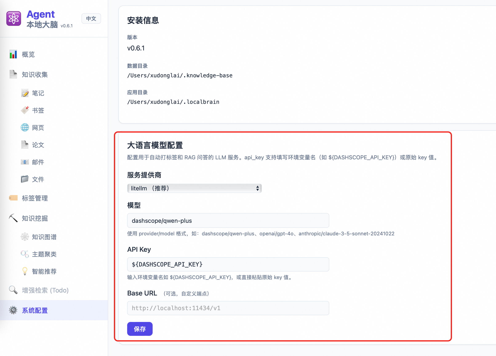

# 基于 Agent + IM + Skill + CLI 的理念，打造一个 Local First 的本地知识大脑系统LocalBrain
> 两个周末、110 次提交、一个 AI 虚拟团队 —— 我是如何与AI协作从0打造一个本地LLM知识管理产品Agentic Local Brain，配合QoderWork+小Q使用更佳，详情参考：http://localbrain.oss-cn-shanghai.aliyuncs.com

---

导读：万字长文解读，可快速浏览每章节图片以及目录掌握大概内容，然后有时间再深入看对应章节。

## 一、引子：你的知识散落在哪里？


### 收集碎片化，知识散落四处

脑子里闪过一个想法，赶紧在钉钉或微信里发给自己一条消息。三天后，你早就忘了它躺在哪个聊天记录的角落里。

读到好文章，手指一点「收藏」。微信收藏夹 200 多条，阅读器「稍后阅读」过百，但你真正回去看的有几篇？浏览器书签栏更是黑洞——300 多条书签分布在十几个文件夹里，根本无从整理。论文下载到本地，半年后连文件名都想不起来。邮件里的精华淹没在几千封邮件中，本地笔记散落在各个目录下。

**现状**：至少 5 个收集入口——微信、钉钉、浏览器书签、阅读器、本地文件夹——但没有一个统一的知识入口，这些工具之间互不相通。你的知识像散落在不同孤岛上的碎片。


### 收集了很多，却发现不了关联

一个真实场景：我要做一个 RAG 系统的技术选型。翻了一下，发现自己其实已经积累了不少相关材料——浏览器书签里有一篇向量数据库的横向评测，微信收藏了一篇讲 chunk 策略的公众号文章，本地还下载过一篇关于 embedding 模型效果对比的论文，上周同事还发过一封邮件讨论检索增强生成的最佳实践。

这些内容明明都在讲同一件事的不同切面，但它们分散在四个不同的工具里，彼此毫无关联。我不得不自己一条一条翻出来、手动拼凑，才意识到「原来这些是一个完整的知识链」。如果有一个地方能自动告诉我：「你收藏的这 5 篇内容都和 RAG 相关，建议一起看」——那该多好。

这就是「知识孤岛」——你收集了足够多的碎片，但没有任何工具帮你发现它们之间的关联，无法形成知识网络。


### AI 时代的新问题

每天和 AI 助手对话产生的有价值信息——解决方案、代码、思路——要么躺在聊天历史里被遗忘，要么手动粘贴到笔记软件再次被遗忘。AI 是强大的知识生产工具，但和知识管理系统是割裂的。

**核心矛盾**：收集的工具很多，但整理的时间没有；存储的地方很多，但发现关联的能力为零；AI 能力很强，但和知识管理是割裂的。

**一句话引出 LocalBrain**：我需要一个系统，能让我在日常工具里随手收集，自动帮我组织和发现关联，而且数据完全在我自己手里。最好还能和 AI 打通——让 AI 成为我知识库的入口和管理员。


---

## 二、市面上的工具为什么没解决这个问题？


我花了一天时间调研体验市面上的知识管理工具，试图找到一个能解决上述问题的方案。结果发现，每类工具都解决了一部分问题，但没有一个能解决全部问题。

### 笔记类：Notion / 飞书 / Obsidian / Logseq

这类工具的核心定位是「写」，擅长创作和结构化笔记。

**擅长的事**：
- 写作体验——富文本编辑、块级操作、模板系统
- 结构化——数据库视图、层级页面、属性字段
- 双向链接——`[[链接]]` 语法，理论上可以建立知识网络

**不擅长的事**：
- 收集——你需要手动打开 Notion，新建页面，粘贴内容，填写属性。每次收集都是一个「决策」过程，摩擦成本很高。
- 发现——虽然支持搜索，但没有语义理解。你搜「机器学习」，找不到「深度学习」或「神经网络」相关内容，除非它们字面上包含「机器学习」。
- 关联——双向链接需要手动创建。你看了 100 篇文章，不会记得每篇应该链接到哪些其他文章。即使你手动建立了链接，当文章数量增长时，维护链接网络也是不可能的任务。

**我的使用体验**：我用 Notion 三年，积累了 500+ 页面。但大部分页面创建后就再也没打开过。搜索功能很弱，经常找不到明明存在的内容。最关键的是，我不知道我的知识库里「有什么」，只知道自己「存了很多」。

### 收藏类：Readwise / Raindrop / 浏览器书签

这类工具的核心定位是「存」，擅长快速收集和稍后阅读。

**擅长的事**：
- 快速收集——浏览器插件一键收藏，移动端分享菜单
- 跨平台同步——手机收藏，电脑上看
- 稍后阅读——阅读器集成，高亮标注

**不擅长的事**：
- 组织——书签只是链接，不包含内容的深度理解。你收藏了 100 个链接，但不知道每个链接的核心观点是什么。
- 发现——没有 AI 能力，无法回答「我收藏过哪些关于 RAG 的内容？」。你只能靠记忆和标签，但标签也是手动维护的。
- 数据主权——你的书签数据托管在别人的服务器上。服务停了、账号被封了，数据就没了。

**我的使用体验**：我用 Raindrop 收藏网页，累计 300+ 条书签。每次收藏的时候很爽，但真正回去看的不到 10%。而且 Raindrop 不支持全文搜索，只能搜标题和描述，经常找不到想要的内容。

### AI 类：Mem.ai / Khoj

这类工具的核心定位是「AI 辅助」，利用 LLM 进行智能整理和问答。

**擅长的事**：
- AI 辅助整理——自动打标签、生成摘要、提取关键信息
- 语义搜索——理解查询意图，找到相关内容
- 自动关联——发现内容之间的联系

**不擅长的事**：
- 云端依赖——数据必须上传到他们的服务器处理。这意味着你的私人笔记、工作文档都要交给第三方。
- 隐私问题——你的知识可能被用来训练模型。即使服务承诺不训练，你也不知道数据在服务器上发生了什么。
- 离线不可用——没有网络，什么都没有。即使只是搜索自己的笔记，也需要联网。

**我的使用体验**：我试用过 Mem.ai，它的自动关联功能很惊艳。但我始终无法把真正重要的知识放进去——因为那是「我」的知识，我不想让它变成「服务提供商的数据」。

### 一个综合对比表格

| 需求 | 笔记类 | 收藏类 | AI 类 | LocalBrain |
|------|--------|--------|-------|------------|
| 多源收集 | ❌ 手动操作 | ✅ 快速收集 | ❌ 有限支持 | ✅ 6 种来源 |
| AI 发现关联 | ❌ 无此能力 | ❌ 无此能力 | ✅ 有 | ✅ 有 |
| 本地数据主权 | ✅ 本地优先 | ❌ 云端托管 | ❌ 云端处理 | ✅ 本地优先 |
| 零摩擦集成 | ❌ 需打开 App | ✅ 浏览器插件 | ❌ 需切换工具 | ✅ IM 对话即收集 |
| 离线可用 | ✅ 完全可用 | ❌ 需联网 | ❌ 需联网 | ✅ 三层降级 |
| 与 AI 打通 | ❌ 无集成 | ❌ 无集成 | ✅ 原生 AI | ✅ Skill 集成 |

**总结**：没有一个工具同时做到**多源收集 + AI 发现 + 本地数据主权 + 零摩擦集成**。

**我想要的**：
1. 收集要零摩擦——在日常工具里随手收集，不需要专门打开一个 App
2. 整理要自动化——AI 自动打标签、建关联，不需要我手动维护
3. 数据要本地——我的知识是我的，不是任何服务商的人质
4. AI 要打通——AI 助手能访问我的知识库，成为我的「外脑」

这四个需求，驱动我设计了 LocalBrain。

---

## 三、LocalBrain 的设计哲学：Agent + IM + Skill + CLI


### Local First = 数据主权

所有知识以 Markdown 文件形式存储在你的本地文件系统中：

```
~/.knowledge-base/
├── raw/              # 原始知识文件
│   ├── files/        # 本地文件（PDF、Markdown）
│   ├── webpages/     # 网页内容（Markdown）
│   ├── papers/       # 学术论文
│   ├── emails/       # 邮件
│   ├── bookmarks/    # 书签
│   └── notes/        # 闪念笔记
├── db/
│   ├── metadata.db   # SQLite 元数据索引
│   └── chroma/       # Chroma 向量索引
└── config.yaml       # 配置文件
```

这个设计的优点：

**可读性**：任何文本编辑器都能打开。不用安装任何软件，`cat` 或 `less` 就能看。十年后，即使 LocalBrain 项目停了，你的知识还在，还能读。

**可 grep**：命令行就能搜索。`grep -r "RAG" ~/.knowledge-base/` 立刻找到所有提到 RAG 的内容。这是最原始但最可靠的搜索方式。

**可版本控制**：Git 天然友好。你可以用 Git 管理知识库，跨机器同步，回溯历史版本。不用担心服务商删数据。

**可迁移**：一个 U 盘拷走，没有任何锁定。你的知识不会被绑架在任何平台。

**没有网络也能搜索**。系统设计了三层降级：

| 场景 | 可用功能 | 不可用功能 |
|------|----------|------------|
| 正常模式 | 语义搜索 + RAG 问答 + 自动标签 | 无 |
| 无 Embedding API | 关键词搜索 + 标签过滤 + 手动标签 | 语义搜索、RAG |
| 无 LLM API | 关键词搜索 + 内置标签提取 | RAG 问答、自动标签 |
| 完全离线 | 关键词搜索 + TF-IDF 标签 | 所有 AI 功能 |

> 一个你敢把重要知识托付的工具，必须能离线工作。

这是我的设计原则：**AI 能力是锦上添花，不是雪中送炭**。即使没有任何 AI 服务，LocalBrain 也能作为一个可靠的知识库使用。

### Agent + IM = 零摩擦采集

这是我设计 LocalBrain 的核心理念之一：**收集要发生在你最常用的工具里**。

过去你把灵感发给自己的钉钉/微信，现在你发给 AI 助手。

同样的动作，不同的结果：
- 发给微信 → 躺在收藏夹里，再也不会打开
- 发给 AI 助手 → 自动入库、自动打标签、自动建立关联、自动生成摘要

在 QoderWork 或 CoPaw 或 OpenClaw 里，对话即收集：

```
你：帮我收藏这个链接 https://example.com/article
AI：已收藏。标题：「RAG 系统优化实践」，自动提取标签：RAG、向量数据库、性能优化。摘要：这篇文章讨论了...

你：帮我存一段笔记：Python 的 GIL 在多线程场景下是性能瓶颈，推荐用多进程或异步 IO
AI：已保存。标签：Python、并发、性能优化。
```

**不需要打开新应用，不需要切换上下文**。你的日常工具就是收集入口。

这背后是一个 Skill（技能插件）在起作用。AI 助手识别你的意图「收藏」「保存」，然后调用 LocalBrain 的 CLI 命令完成操作。整个过程对你来说是「对话」，对 AI 来说是「工具调用」。

**零摩擦的意义**：收集的摩擦成本越低，收集频率越高。如果每次收集都要打开一个专门的 App，你会倾向于「以后再说」。而「以后」通常意味着「永远不会」。

把收集变成对话，摩擦成本降到最低，收集变成一种自然的行为。

### Skill = 可组合的能力插件

Skill 是 AI Agent 的能力扩展机制。一个 Skill 定义了：

- **触发条件**：什么情况下应该激活这个 Skill
- **意图识别**：用户说的是什么意思
- **命令映射**：意图如何映射到具体的 CLI 命令
- **结果解析**：如何把 CLI 输出翻译成自然语言回复

 以`knowledge-collect-localbrain` Skill为例：

```yaml
name: knowledge-collect-localbrain
version: 0.6.1
description: 收集知识到本地知识库

trigger_conditions:
  - "save to knowledge base"
  - "collect this"
  - "保存到知识库"
  - "收藏这个"

intent_recognition:
  # URL → 默认是网页收集
  - pattern: ".*?(https?://\\S+).*?"
    action: webpage
  # arXiv → 论文收集
  - pattern: ".*?(arxiv:\\d+\\.\\d+).*?"
    action: paper
  # 本地路径 → 文件收集
  - pattern: ".*?(/[\\w/-]+\\.(pdf|md|txt)).*?"
    action: file
  # 纯文本+关键词 → 笔记
  - pattern: "(记|存|保存).*(想法|笔记|点子)"
    action: note
```

**30 秒安装，即插即用**。具体参考：http://localbrain.oss-cn-shanghai.aliyuncs.com/docs/Skill-安装

更重要的是，Skill 是**可组合**的。知识收集只是第一个 Skill，未来可以扩展：
- `knowledge-mine` —— 知识挖掘（v0.6 已实现）
- `knowledge-share` —— 知识分享
- `knowledge-sync` —— 多设备同步

每个 Skill 独立工作，但共享同一个知识库。这就像给 AI Agent 安装「技能包」，按需扩展能力。

### CLI = Agentic 时代的原生接口

**这是最关键的设计决策，也是我想重点讨论的部分。**

很多人觉得 CLI 是「为了自动化友好」或者「给技术用户用的」。**这个理解是错的。**

CLI 不是为了自动化，而是**面向 Agentic 更加亲和**。

让我用一张表格来说明：

| 维度 | REST API | SDK | CLI |
|------|----------|-----|-----|
| AI 理解方式 | 读 OpenAPI spec / Swagger，需要理解 HTTP 语义 | 读类型定义和源码，需要理解编程语言 | `--help` 即 prompt，自描述 |
| 一次交互的完整性 | 一个 endpoint = 一个原子操作，组合需编排 | 需要写胶水代码，管理状态 | 一条命令 = 一个完整意图 |
| Agent 执行方式 | 构造 HTTP 请求（认证、Header、Body、错误处理） | import + 实例化 + 调用，需要环境配置 | `shell("localbrain collect webpage <url>")` |
| 学习成本 | 高（需要理解 API 规范） | 中（需要理解 SDK 设计） | 低（命令即文档） |
| 调试难度 | 高（网络问题、认证问题、格式问题） | 中（依赖问题、版本问题） | 低（直接运行看输出） |

**CLI 的三个 Agentic 属性**：

**1. 自描述** —— `--help` 就是 prompt

```
$ localbrain collect --help
Usage: localbrain collect [COMMAND] [OPTIONS]...

Commands:
  file      收集本地文件（PDF、Markdown、文本）
  webpage   收集网页内容
  paper     收集学术论文（arXiv）
  email     收集邮件
  bookmark  收藏书签
  note      创建闪念笔记

Options:
  --tags TEXT      手动指定标签（可多次使用）
  --summary TEXT   手动指定摘要
  --skip-existing  跳过已存在的内容
```

Agent 只需要读取这个帮助信息，就能理解如何使用工具。不需要额外文档，不需要 API 规范。

**2. 功能自闭环** —— 一条命令完成一个完整动作

```bash
# 收集一个网页，自动抓取、提取、打标签、入库
localbrain collect webpage add https://example.com/article

# 搜索语义相关内容
localbrain search semantic "机器学习"

# 启动 Web 界面
localbrain web --background
```

每条命令都是「一个意图 → 一个动作 → 一个结果」。不需要组合多个 API 调用，不需要管理中间状态。

**3. 零摩擦执行** —— Agent 只需 shell access

```
Agent 不需要：
- 安装 SDK
- 配置认证（API Key、Token）
- 处理 HTTP 错误（401、403、500）
- 理解 JSON 格式

Agent 只需要：
- Shell 执行权限
- 解析文本输出
```

**案例：CLI-Anything 的启示**

香港大学 HKUDS 实验室的开源项目 **CLI-Anything** 做了一件有趣的事：把 GIMP、Blender、LibreOffice 等 GUI 桌面软件都包装成 CLI，让 AI Agent 能通过命令行操控专业软件。

他们的核心洞察是：**CLI 是不同软件间最大公约数的交互协议**。

- GUI 需要视觉理解（AI 还不擅长）
- API 需要 HTTP 理解（增加复杂度）
- CLI 只需要文本理解（AI 最擅长）

LocalBrain 的设计哲学是 **CLI-first, API-second**：
- FastAPI 是给 Web UI 用的（人类用户）
- CLI 才是给 Agent 用的第一等公民

```bash
# Agent 只需要这一行
localbrain collect webpage add https://example.com/article

# 不需要：
# 1. 读 API 文档
# 2. 理解认证方式
# 3. 构造 JSON body
# 4. 处理 HTTP 错误
# 5. 解析响应格式
```

这是 Agentic 时代的产品设计原则：**让 AI Agent 能用最自然的方式调用你的工具**。而 CLI，就是最自然的方式。

---

## 四、系统全景：从收集到发现的知识链路


### 整体架构

LocalBrain 的架构设计遵循「分层解耦」原则：

```
┌─────────────────────────────────────────────────────────────────┐
│                         用户交互层                                │
│  ┌─────────────┐  ┌──────────────┐  ┌─────────────────────────┐ │
│  │  CLI 工具   │  │   Web UI     │  │   IM Agent (Skill)      │ │
│  │  localbrain │  │  (FastAPI)   │  │  (QoderWork/CoPaw/钉钉)  │ │
│  └──────┬──────┘  └──────┬───────┘  └────────────┬────────────┘ │
└─────────┼────────────────┼───────────────────────┼──────────────┘
          │                │                       │
          ▼                ▼                       ▼
┌─────────────────────────────────────────────────────────────────┐
│                         核心引擎层                                │
│  ┌─────────────┐  ┌──────────────────┐  ┌─────────────────────┐ │
│  │ Collectors  │  │   Processors     │  │       Query         │ │
│  │ 收集器模块   │  │   处理器模块      │  │     查询模块         │ │
│  │             │  │                  │  │                     │ │
│  │ - File      │  │ - Chunker 分块   │  │ - Semantic Search   │ │
│  │ - Webpage   │  │ - Embedder 向量化│  │ - Keyword Search    │ │
│  │ - Bookmark  │  │ - Tagger 标签    │  │ - RAG Q&A           │ │
│  │ - Paper     │  │ - Entity 实体    │  │ - Graph Query       │ │
│  │ - Email     │  │ - Topic 主题     │  │ - Recommend 推荐    │ │
│  │ - Note      │  │ - Relation 关系  │  │                     │ │
│  └─────────────┘  └──────────────────┘  └─────────────────────┘ │
└─────────────────────────────────────────────────────────────────┘
          │                                        │
          ▼                                        ▼
┌─────────────────────────────────────────────────────────────────┐
│                         存储层                                    │
│  ┌─────────────────────────┐    ┌─────────────────────────────┐ │
│  │    SQLite Storage       │    │     ChromaDB Storage        │ │
│  │    元数据 + 标签 + 实体   │    │     向量 Embeddings         │ │
│  │    + 关系 + 主题 + 历史   │    │                             │ │
│  └─────────────────────────┘    └─────────────────────────────┘ │
│  ┌─────────────────────────────────────────────────────────────┐│
│  │                   文件系统 (Markdown)                        ││
│  │                   原始内容 + YAML 元数据                      ││
│  └─────────────────────────────────────────────────────────────┘│
└─────────────────────────────────────────────────────────────────┘
```

### 采集层：6 种数据源

LocalBrain 支持六种知识来源，覆盖日常工作和学习的常见场景：

| 来源 | CLI 命令 | 典型场景 |
|------|----------|----------|
| 本地文件 | `localbrain collect file add <path>` | PDF 论文、Markdown 笔记、代码文件 |
| 网页 | `localbrain collect webpage add <url>` | 技术博客、新闻文章、在线文档 |
| 学术论文 | `localbrain collect paper add arxiv:ID` | arXiv 论文、学术论文 PDF |
| 邮件 | `localbrain collect email add <path>` | 重要邮件、讨论线程 |
| 书签 | `localbrain collect bookmark add <url>` | 快速收藏链接、浏览器书签导入 |
| 闪念笔记 | `localbrain collect note add "text"` | 灵感、想法、临时记录 |

每种来源都有专门的 Collector（收集器）处理：
- **FileCollector**：支持 PDF、Markdown、TXT、代码文件。PDF 使用 PyPDF2 提取文本，Markdown 直接读取。
- **WebpageCollector**：使用 `httpx` + `readability-lxml` 抓取并提取正文，转换为 Markdown 格式。
- **PaperCollector**：支持 arXiv ID 或 URL，自动下载 PDF 并提取元数据。
- **EmailCollector**：支持 `.eml` 单封邮件和 `.mbox` 邮件夹。
- **BookmarkCollector**：单个书签收藏，也支持从 Chrome/Safari/Firefox 导入书签文件。
- **NoteCollector**：快速记录短文本，适合灵感捕捉。

### 处理层：从原始内容到结构化知识

原始内容进入系统后，经过一系列处理管道：

```
原始内容
    │
    ▼
┌─────────────┐
│   Chunker   │ ─── 文档分块，支持长文档
│   分块器     │     默认 1000 字/块，100 字重叠
└──────┬──────┘
       │
       ▼
┌─────────────┐
│  Embedder   │ ─── 向量化，存入 ChromaDB
│  向量化器    │     支持 DashScope/OpenAI/Ollama
└──────┬──────┘
       │
       ▼
┌─────────────┐
│   Tagger    │ ─── 标签提取（三层降级）
│  标签提取    │     用户指定 > LLM > TF-IDF
└──────┬──────┘
       │
       ▼
┌─────────────┐
│  Entity     │ ─── 实体抽取（v0.6 新增）
│  实体抽取    │     人物、概念、工具、项目、组织
└──────┬──────┘
       │
       ▼
┌─────────────┐
│  Topic      │ ─── 主题聚类（v0.6 新增）
│  主题聚类    │     HDBSCAN 自动发现主题数量
└──────┬──────┘
       │
       ▼
┌─────────────┐
│  Relation   │ ─── 跨文档关系发现（v0.6 新增）
│  关系构建    │     共享实体 → 文档关联
└─────────────┘
```

**智能提取的三层降级**：

| 层级 | 来源 | 说明 | 示例 |
|------|------|------|------|
| Tier 1 | 用户手动提供 | 命令行参数 `--tags` `--summary` | `--tags AI,ML --summary "深度学习综述"` |
| Tier 2 | LLM 自动提取 | 调用 DashScope/OpenAI，提取 3-5 个标签 | LLM 分析内容，返回标签列表 |
| Tier 3 | 内置算法 | TF-IDF 关键词 + 抽取式摘要，零依赖 | 从文本中提取高频词作为标签 |

这个设计保证：**即使没有任何 AI 服务配置，收集功能也能正常工作**。

### 知识挖掘：发现你不知道的关联

v0.6 版本引入了「知识挖掘」模块，解决了「收集了但不知道有什么关联」的问题。

**自动知识图谱构建**

系统自动从文档中抽取实体（人物、概念、工具、项目、组织），并构建实体间的关系。


上图展示了一个真实知识库的图谱：259 个实体通过 291 条关系连接。节点大小表示提及次数，边的粗细表示关联强度。

点击任意节点，可以看到：
- 这个实体在哪些文档中出现
- 与其他实体有什么关系
- 相关的引用片段

**主题聚类**

使用 HDBSCAN 算法自动发现主题数量，无需手动指定。系统会告诉你：「你的知识库目前聚焦在 3 个领域」。


与 K-Means 不同，HDBSCAN：
- 不需要预设主题数量
- 能发现任意形状的聚类
- 自动识别噪声点（不属于任何主题的文档）

**智能推荐**

基于阅读历史 + 时间衰减模型，推荐「你可能感兴趣但还没读的内容」。


推荐算法考虑：
- **内容相似度**：与最近阅读内容相似的文档
- **时间衰减**：最近阅读权重更高
- **阅读状态**：优先推荐未读内容
- **关联强度**：与已读文档关联度高的内容

### 优雅降级：离线也能用

这是 LocalBrain 最重要的设计原则之一。

| 场景 | 影响 | 降级方案 |
|------|------|----------|
| 嵌入服务不可用 | 语义搜索禁用 | 降级为 SQLite FTS5 关键词搜索 |
| LLM 不可用 | RAG 问答禁用 | 返回搜索结果，不生成 AI 回答 |
| LLM 不可用 | 自动标签降级 | 使用内置 TF-IDF 提取关键词 |
| 两者均不可用 | 极简模式 | 关键词搜索 + 内置标签提取 |

**一个你敢把重要知识托付的工具，必须能离线工作。**

想象一下：你在飞机上，或者在无网络的咖啡馆，突然想查一个知识点。如果工具告诉你「需要联网才能使用」，那种无力感……LocalBrain 不会让你面对这种情况。

### Web UI：可视化浏览和管理

启动 Web 界面：

```bash
localbrain web              # 前台运行
localbrain web -b           # 后台守护进程
localbrain web --status     # 查看状态
localbrain web --stop       # 停止服务
```

Dashboard 展示知识库概览：


网页列表支持标签筛选和搜索：


知识图谱底部详情：


---

## 五、100% AI 开发：两个周末的全过程记录


### 时间线总览

- **3 月 24 日**：第一行代码 `init agentic second brain`
- **3 月 24-26 日**：第一个周末，知识收集&搜索核心功能（收集、搜索、Web UI）
- **3 月 27-31 日**：工作日晚间碎片化开发（每天 10-30 分钟）
- **4 月 1-5 日**：第二个周末，知识挖掘（图谱、聚类、推荐）
- **当前版本**：v0.6.1

**Git 统计**：110 次提交，从「init」到完整的产品。

关键里程碑：
- **v0.5.0**：核心功能完成（收集 + 搜索 + Web UI）
- **v0.5.7**：迁移到 LiteLLM（支持更多模型提供商）
- **v0.6.0**：知识挖掘（图谱 + 聚类 + 推荐）
- **v0.6.1**：UX 增强（书签导入优化、命令重构）

### 第一个周末：知识收集核心功能

**Day 1 上午：数据模型设计**

我花了两小时思考数据模型。这是我做的最重要的决策之一。

最终决定用 **Markdown + YAML front matter**：

```markdown
---
id: webpage_20260324_143022
title: "RAG 系统优化实践"
source: https://example.com/rag-optimization
content_type: webpage
collected_at: 2026-03-24T14:30:22
tags:
  - RAG
  - 向量数据库
  - 性能优化
summary: 这篇文章讨论了 RAG 系统的检索质量优化策略...
word_count: 3420
---

**Day 1 下午：第一个 Collector**

我用AI写了第一个 Collector —— `FileCollector`。同时定义了 `BaseCollector` 抽象基类：

```python
class BaseCollector(ABC):
    @abstractmethod
    def collect(self) -> CollectResult:
        """执行收集操作"""
        pass
    
    @abstractmethod
    def _extract_content(self) -> str:
        """从来源提取内容"""
        pass
    
    def _generate_metadata(self, content: str) -> Dict:
        """生成元数据（可复用）"""
        pass
```

然后我告诉 AI：「照着 FileCollector 的模式，生成其他 5 个 Collector：WebpageCollector、PaperCollector、EmailCollector、BookmarkCollector、NoteCollector。保持相同的接口和风格。」

1 小时后，6 个 Collector 全部完成，代码风格一致，每个都有测试用例。这就是 AI 的「模式复制」能力。

**Day 2：搜索引擎**

搜索是知识管理的核心。我设计了三种搜索方式：

| 类型 | 原理 | 依赖 | 场景 |
|------|------|------|------|
| 语义搜索 | 向量相似度 (cosine similarity) | Embedding API | 「找相关内容」 |
| 关键词搜索 | SQLite FTS5 全文索引 | 无 | 「精确查找」 |
| RAG 问答 | 检索 + LLM 生成 | Embedding + LLM | 「提问得答」 |

实现顺序：
1. 先做关键词搜索（无依赖，保证基础可用）
2. 再做语义搜索（依赖 ChromaDB）
3. 最后做 RAG（依赖两者结合）

AI 帮我快速实现了 ChromaDB 集成和 FastAPI 后端。我只做了架构决策和 Code Review。

**Day 3-4：Web 前端 + CLI**

前端我选择了一个极简方案：**单文件 Vue.js**。把所有逻辑写在一个 `index.html` 里，不需要构建工具，不需要 npm。

为什么？

1. **快速开发**：不需要配置 Webpack/Vite，不需要管理依赖
2. **易于维护**：一个文件，一目了然
3. **部署简单**：FastAPI 静态文件托管即可
4. **够用就好**：这是内部工具，不需要企业级前端架构

整个前端只有 800 行代码，但功能完整：
- Dashboard 统计视图
- 知识条目列表（分页、筛选）
- 标签管理
- 搜索界面
- 知识图谱可视化（ECharts）
- 主题聚类视图

### 工作日碎片化开发

工作日每天只有晚上 10 点后的零散时间。我会给 AI 分配小任务，每天推进一点点：

- **周一晚上**：加一个 `localbrain stats` 命令，展示知识库统计
- **周二晚上**：优化嵌入服务连接错误处理，增加重试机制
- **周三晚上**：给网页列表加标签筛选功能
- **周四晚上**：修复一个分块边界 bug
- **周五晚上**：写单元测试，覆盖核心模块

每天 10-30 分钟，积少成多。这种开发模式在传统软件开发中几乎不可能——上下文切换成本太高。但 AI 能记住之前的对话，第二天接着昨天的工作继续，几乎没有启动成本。

### 第二个周末：知识挖掘

v0.5 解决了「存」和「找」的问题，但还没解决「发现」的问题。

**Day 1：实体抽取 → 知识图谱**

第一步是从文档中抽取实体。我设计了一个简单的 LLM prompt：

```
从以下文本中抽取实体，类型包括：
- person（人物）
- concept（概念）
- tool（工具）
- project（项目）
- organization（组织）

输出 JSON 格式：
[
  {"name": "Transformer", "type": "concept", "description": "一种神经网络架构"},
  {"name": "OpenAI", "type": "organization", "description": "AI 研究公司"}
]
```

抽取结果存入 SQLite，然后我用 ECharts 的 graph 组件做可视化，力导向布局，效果不错。

**Day 2：跨文档关系发现**

第二步是发现「不同文档提到同一实体」的情况，这个逻辑很简单，但效果很惊艳。系统自动发现了我没意识到的关联：
- 「A 论文」和「B 博客」讨论同一个算法
- 「C 邮件」引用了「D 文档」里的概念

**Day 3：主题聚类**

我选择了 HDBSCAN 算法，因为它：
- 不需要预设主题数量（自动发现）
- 能发现任意形状的聚类
- 自动识别噪声点（不属于任何主题的文档）

**Day 4：智能推荐**

基于阅读历史 + 时间衰减，推荐列表展示在 Web 首页，每次刷新都有新发现。

### AI 虚拟团队的工作模式

整个开发过程采用了「虚拟团队」模式。虽然只有我一个人，但通过 AI 扮演不同角色，实现了多角色协作。

| 角色 | 职责 | 谁来扮演 | 具体工作 |
|------|------|----------|----------|
| 产品经理 | 定义需求、优先级 | 我 | 写需求文档、决定做什么不做什么 |
| 架构师 | 技术方案设计 | AI + 我 | 设计数据模型、模块划分、接口定义 |
| 开发 | 写代码 | AI | 实现具体功能、编写测试用例 |
| QA | 测试用例、边界检查 | AI | 生成测试场景、检查边界情况 |
| SRE | 部署、监控、文档 | AI | 写文档、配置文件、安装脚本 |

每个功能完成后，我会让 AI 模拟 V-Model 评审：

```
我：完成了 FileCollector，请做代码评审

AI（扮演架构师）：这个设计考虑了扩展性，但建议：
1. 实体表缺少 created_at 字段，不利于追踪
2. 错误处理可以更细粒度

AI（扮演 QA）：边界情况考虑：
1. 如果文件是空的怎么办？
2. 如果文件编码不是 UTF-8？
3. 如果文件被其他进程占用？

AI（扮演 SRE）：建议增加：
1. 一个重建索引的 CLI 命令
2. 配置文件校验逻辑
```

一轮评审下来，代码质量明显提升。这种「自己评审自己」的模式在传统开发中需要真实的团队成员，但现在 AI 可以扮演这些角色。

---

## 六、关键认知：AI 擅长什么，人必须做什么


经过这两个周末的实践，我对「AI 辅助开发」有了更深的认知。有些事情 AI 做得比人好，有些事情人仍然不可替代。

### AI 的超能力

**1. 模式复制**

我写了第一个 FileCollector，定义了抽象基类。然后告诉 AI：「照着这个模式，生成其他 5 个 Collector」。

1 小时后，6 个 Collector 全部完成：
- 代码风格完全一致
- 接口统一
- 每个都有对应的测试用例
- 文档注释完整

这种「从一个样本生成多个变体」的能力，AI 表现极其出色。而且它不会厌倦，不会因为重复工作而降低质量。

**2. 重构迁移**

从 v0.5.6 升级到 v0.5.7 时，我把 DashScope SDK 替换为 LiteLLM。这是一个大重构。

我只需要告诉 AI：「把所有 DashScope 调用替换为 LiteLLM，保持接口不变。」

30 分钟后，所有代码迁移完成。AI 找到了所有调用点，正确处理了参数映射，更新了测试用例，测试全部通过。

这种重构工作，传统开发中需要仔细阅读每一行代码，确保不遗漏。AI 可以一次性处理整个代码库，而且不会疲劳犯错。

**3. 无聊但重要的活**

写测试用例、写文档、处理边界情况——这些工作很重要，但很无聊。AI 做得很好，而且不会抱怨。

比如，我让 AI 为 `Embedder` 类写测试用例，它自动生成了覆盖各种场景的测试，包括正常流程、边界情况、错误处理。如果让我自己写，可能只会写两三个基本用例。

**4. 对称性工作**

如果你写了 `create_entity()`，AI 能自动生成 `update_entity()`、`delete_entity()`、`list_entities()`，因为它们是对称的。

这种「完成一个，自动完成一组」的能力，大大提高了开发效率。

### 人不可替代的部分

**1. 产品直觉**

「用户需要什么功能？」——这个问题 AI 无法回答。

AI 可以告诉你「技术上可行」，但不会告诉你「用户真正想要」。它可以生成代码，但不能决定「做什么」。

比如，「要不要加一个时间线视图？」AI 会说「技术上可以实现，我帮你写代码」。但「要不要加」这个决策，必须由人来做。

**2. 架构哲学**

「为什么用 SQLite 不用 Neo4j？」

AI 建议 Neo4j 是图数据库，更适合知识图谱。从「最优解」角度，它是对的。

但我选择了 SQLite，因为：
- 部署简单——无需额外服务
- 数据本地化——单个文件
- 够用——259 个实体、291 条关系，SQLite 完全够用
- 可靠——SQLite 经过几十年的验证，bug 极少

这是「够用就好」的哲学，不是「最优解」。这种权衡，AI 做不了。

**3. 品味和克制**

「要不要加一个时间线视图？」——这是一个需求诱惑。

AI 能帮你实现任何功能，但**不加什么**比**加什么**更需要克制。

v0.6 只做了 4 个 P0/P1 功能：
- 知识图谱（P0）
- 跨文档关系（P0）
- 主题聚类（P1）
- 智能推荐（P1）

时间线视图、AI 综述生成、知识缺口分析——这些都有价值，但放到 v0.7。

克制让产品更聚焦。什么功能都想加，最后变成一个什么都做但什么都不精的四不像。

**4. Debug 洞察力**

AI 写的代码有时会出 bug。当测试失败时，AI 可能会「猜」原因，来回尝试：

```
AI：可能是路径问题，我加一个 os.path.abspath()
AI：还是失败，可能是编码问题，我加 encoding='utf-8'
AI：还是失败，可能是权限问题...
```

但真正的问题可能是另一个原因。人需要判断「真正的问题在哪里」，然后用正确的思路引导 AI。

### 具体决策故事

每个决策背后都有考量，我分享几个关键决策的故事：

**为什么用 SQLite 不用 Neo4j？**

当时 AI 建议用 Neo4j，理由是「知识图谱是图结构，Neo4j 是图数据库，天然匹配」。

我考虑了以下几点：
1. **部署复杂度**：Neo4j 需要单独部署一个服务，SQLite 只是一个文件
2. **数据迁移**：SQLite 文件可以直接拷贝，Neo4j 需要导出导入
3. **学习成本**：团队需要学习 Cypher 查询语言
4. **实际需求**：我的知识库目前只有几百个实体，SQLite 完全够用
5. **可靠性**：SQLite 经过几十年验证，稳定可靠

结论：够用就好，不要过度设计。如果未来数据量增长到需要 Neo4j，再迁移也不迟。

**为什么三层降级？**

因为我希望用户因为 API 配置问题就无法使用是不合理的。

场景一：用户没有 DashScope/OpenAI API Key
- 应该还能用关键词搜索
- 应该还能手动打标签

场景二：用户在飞机上，完全离线
- 应该还能查看已收集的内容
- 应该还能搜索（关键词）

场景三：用户的 API Quota 用完了
- 系统不应该崩溃
- 应该优雅降级

一个本地优先的工具，不应该依赖外部服务才能工作。这是可靠性设计的基本原则。

### 一句话总结

**AI 不是替代你，是让你一个人可以做一个团队的事。**

过去，一个项目需要 N 个角色：产品经理、架构师、前端工程师、后端工程师、测试工程师、运维工程师。

现在，一个人 + AI = 一个团队。

但你必须具备「指挥 AI」的能力——知道什么时候该用什么角色，知道什么是重要的决策，知道什么时候该克制。

---

## 七、使用指南：如何开始用 LocalBrain 管理你的知识

### 安装 LocalBrain

LocalBrain 支持三种安装方式，5 分钟内即可启动运行。

**Python 包安装（推荐）**

适用于所有平台，无安全警告。需要 Python 3.8+。

macOS/Linux：

```bash
curl -fsSL http://localbrain.oss-cn-shanghai.aliyuncs.com/python_installer/install.sh | sh
```

Windows (PowerShell)：

```powershell
irm http://localbrain.oss-cn-shanghai.aliyuncs.com/python_installer/install.ps1 | iex
```

**安装后设置**

```bash
localbrain doctor      # 验证安装
localbrain init setup  # 使用引导式设置初始化
```

`init` 命令会创建：
- 配置文件 `~/.localbrain/config.yaml`
- 数据目录 `~/.knowledge-base/`
- 用于元数据的 SQLite 数据库
- 用于向量嵌入的 ChromaDB 存储

**配置 AI 服务（可选）**

如需智能标签提取和语义搜索，编辑 `~/.localbrain/config.yaml`或者在如下界面中配置：



测试连接：

```bash
localbrain test embedding
localbrain test llm
```

> AI 服务是可选的。即使没有它们，LocalBrain 仍然可以使用内置的 TF-IDF 和提取式算法正常工作。

### 通过 QoderWork/CoPaw Skill + 钉钉小Q

这是零摩擦的最佳方式——日常对话即收集。

**30 秒安装 Skill**

最快的方式：在你的 AI 编程助手（Qoder、OpenClaw、Copaw 等）的聊天窗口中粘贴以下消息：

```
帮我安装或更新这个知识收集技能：http://127.0.0.1:8080/docs/skills/knowledge-collect-localbrain/SKILL.md
```

就是这么简单！AI 助手会自动下载并安装该 Skill。前提是 LocalBrain 已安装并且 Web 服务器正在运行（`localbrain web -b`）。

**日常使用**

```
你：把这篇文章存到知识库 https://example.com/article
小Q：已收藏。标题：「RAG 优化实践」，标签：RAG、向量数据库。摘要：...

你：帮我找一下之前存的关于 embedding 的内容
小Q：找到 3 条相关内容：
  1. 「Embedding 选型指南」- 2026-03-20
  2. 「向量数据库对比」- 2026-03-18
  3. 「深度学习 Embedding 技术演进」- 2026-03-15
 需要我展示详细内容吗？

你：帮我记一个想法：GIL 是 Python 并发的瓶颈，但异步 IO 可以绑过
小Q：已保存。标签：Python、并发、性能优化。
```

访问 `http://127.0.0.1:8080` 查看你的知识库。

Dashboard 显示：
- 知识条目总数（32 条）
- 标签数量（121 个）
- 各类型分布（文件、网页、论文、邮件、书签、笔记）
- 最近收集的内容

---

## 八、未来展望与反思


### Roadmap

**v0.7 计划（下一个迭代）**：

1. **时间线视图**：知识的时间维度，可视化展示「什么时候关注了什么」
2. **知识空白分析**：发现你的知识库里缺少什么，主动推荐补充方向
3. **AI 综述生成**：针对某个主题，自动生成知识综述

**长期愿景**：

1. **个人 AI 的记忆层**：你的知识库就是你定制的 AI 的上下文。当 AI 知道你的知识库，它可以提供更个性化的回答。
2. **开放生态**：更多 Skill、更多集成。知识收集只是开始，未来可以有知识分享、知识协作、知识变现等场景。

### 对 AI 开发的反思

**AI 改变了什么？**

- **开发速度**：两个周末，完成了一个团队一个月的工作量。这不是夸张，是真实的时间对比。
- **技能门槛**：不需要精通前端/后端/数据库，AI 会帮你。你只需要知道「要做什么」。
- **迭代节奏**：可以更快地验证想法。想到了就实现，不行就换，没有沉重的设计成本。

**AI 没有改变什么？**

- **产品判断**：知道做什么、不做什么。AI 可以实现任何功能，但无法告诉你哪个功能更重要。
- **架构决策**：权衡利弊、做取舍。「最优解」和「合适解」是两回事，后者需要人的判断。
- **品味**：代码质量、用户体验、文档风格。AI 可以生成代码，但「好代码」的品味来自人。

**最大的认知转变**：

过去，一个项目需要 N 个角色：产品经理、架构师、前端工程师、后端工程师、测试工程师、运维工程师。一个人不可能同时精通所有领域。

现在，一个人 + AI = 一个团队。你可以让 AI 扮演不同角色，而你作为「指挥官」做决策。

但你必须具备「指挥 AI」的能力——知道什么时候该用什么角色，知道什么是重要的决策，知道什么时候该克制。这种能力，需要实践积累。

### 对知识管理的反思

**知识管理不是存储，是发现。**

存储很容易——复制粘贴谁都会。收藏一篇文章只需要一秒钟。但「发现自己不知道的东西」很难。

LocalBrain 的价值不仅仅在于「帮你存」，而在于「帮你发现」：

- **发现关联**：A 和 B 原来在讨论同一件事。当你看到知识图谱上的连线，你会惊讶「原来这两个概念有关联」。
- **发现空白**：你在某个领域投入太少。当你看到主题聚类分布不均，你会意识到「我需要补充这方面的知识」。
- **发现趋势**：你的关注点如何随时间变化。当你回顾历史，你会发现自己的知识轨迹。

**知识管理的终极形态是「外脑」。**

你的大脑负责思考和创造，外脑负责记忆和关联。

当你需要某个知识点时，不需要在大脑里搜索，只需要问外脑。当你想了解一个领域时，不需要从头学起，只需要看外脑已经积累了什么。

理想状态下，外脑应该：
1. **零摩擦输入**：想到就存，不需要专门操作
2. **自动组织**：AI 帮你打标签、建关联
3. **随时访问**：本地优先，离线可用
4. **智能输出**：问答、综述、推荐

LocalBrain 就是这样的定位，并正在朝这个方向不断深化。

### 最后的话

两个周末、110 次提交、一个 AI 虚拟团队。

我证明了：**一个人可以做一个团队的事**。

这不是说 AI 比人强，而是说 AI 让一个人可以拥有团队的「能力覆盖」。你不再需要精通前端、后端、数据库、测试、安装部署——AI 可以帮你处理这些。你需要的是：产品判断、架构决策、品味和克制。

如果你想试试 LocalBrain，这里有三个入口：

- **产品主页**：[http://localbrain.oss-cn-shanghai.aliyuncs.com/](http://localbrain.oss-cn-shanghai.aliyuncs.com/)
- **Skill 一键安装**：[http://localbrain.oss-cn-shanghai.aliyuncs.com/docs/skill-install.html](http://localbrain.oss-cn-shanghai.aliyuncs.com/docs/skill-install.html)
- **五分钟快速开始**：[http://localbrain.oss-cn-shanghai.aliyuncs.com/docs/五分钟本地快速安装配置](http://localbrain.oss-cn-shanghai.aliyuncs.com/docs/五分钟本地快速安装配置)

有任何问题或建议，欢迎在钉钉里找我聊聊。这个项目还在快速迭代，你的反馈会让它变得更好。


---

> 「知识管理的本质，是让过去的知识为未来的你服务。」

希望 LocalBrain 能成为你的外脑。
